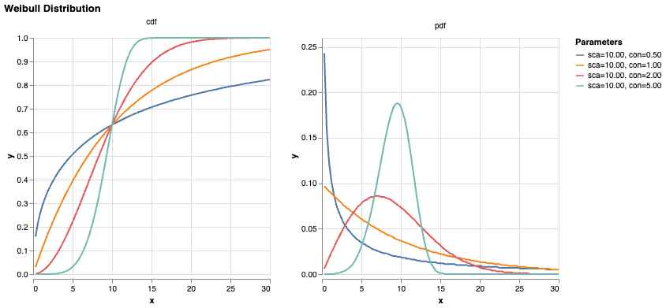

# Parametric Survival Library
This library is being used to model survival times (T) in clinical studies, given patient data (X) and censoring times (C). A parametric model maps from X to latent distribution parameters ($\theta$), which  parameterise a survival function over time, $S(t)=\mathbb{P}(T>t;\theta)$.

## Data

We have a dataset of 42,456 individuals, of which 139 (0.33%) were diagnosed with the disease at some time (T) during the study period. The study duration for each individual varies and is denoted by the random variable C, which we call the censoring time for each individual. If the individual is not diagnosed by the end of the study, we don't know whether they'll develop the disease later or not at all. We call this *right-censoring*.

We can model the discrete variable, $\mathbb{P}(D)=\mathbb{P}(T<C)$, or the continuous variable, $\mathbb{P}(Y < t) = \mathbb{P}(\min(T,C)<t)$.

## Distributions
In survival analysis, we define "survival" as the absence of a critical event, e.g. death or disease diagnosis. At any time $t$, we define the "hazard" $h(t)$ as the chance of the event occurring, conditional on the fact that it hasn't yet occurred.

$$h(t) = \lim_{\Delta t \rightarrow 0} \frac{\mathbb{P}(t < T < t + \Delta t | T > t)}{\Delta t} = \frac{f(t)}{S(t)}$$

Since $S(t) = 1-F(t)$, we have

$$h(t) = -\frac{S'(t)}{S(t)}$$
$$H(t) = -\log(S(t))$$
$$S(t) = \exp(-H(t))$$

where $H(t) = \int_0^t h(u) du$ is the "cumulative hazard". Suppose $H(t) = (t/\lambda)^k$, then

$$S(t) = e^{-(t/\lambda)^k}$$
$$F(t) = 1 - e^{-(t/\lambda)^k}$$
$$f(t) = \frac{k}{\lambda}\left(\frac{t}{\lambda}\right)^{k-1}e^{-(t/\lambda)^k}$$

This is the known as the Weibull distribution, where \( $\lambda > 0$ \) is the scale parameter and \( $k > 0$ \) is the shape parameter. When $k=1$, this reduces to an Exponential distribution.

Since we aren't modelling death, not everyone is expected to see an event in their lifetimes. We model this using an additional parameter $A = 1-S(t)$ as $t \rightarrow \infty$.

## Parameters
We model parameters $\theta = (A, \lambda, k)$ as a function of features $X$ using linear regression and non-linear output transformations that enforce bounds on the parameters. Specifically,

$$A = \sigma(W_AX)$$
$$\lambda = 5000\sigma(W_\lambda X)$$
$$k = 5\sigma(W_kX)$$

## Parametric Survival Model
Recall that each individual has features $X$, survival time $T$, and censoring time $C$. Putting everything together, our linear parameter model maps $X \mapsto (A,\lambda,k)$, and

$$
\mathbb{P}(Y=t|t,c;A,\lambda,k) = 
\begin{cases}
f(t;A,\lambda,k) & t < c \\
1-F(c;A,\lambda,k) & t = c
\end{cases}
$$

where the latter expression comes from the fact that $\mathbb{P}(Y=c) = S(c)$.

## Synthetic Data
We use a *ScaledWeibull* distribution and a known linear parameter model to generate synthetic data for testing.

## Training
We use *scipy.minimize* to fit the linear parameter model such that the negative log-likelihood across the training data is minimised. Since the dataset is heavily imbalanced, we avoid overfitting by training each class $D = \text{true/false}$ with equal weighting. It may be necessary to further up-weight the diagnosed likelihoods due to differences in magnitude - $f(t) \approx 10^{-3} F(c)$.

## Evaluation
There are several ways to evaluate model performance. The most straightforward is to plot the ROC for survival predictions. Since our discrete $D$ variable represents event occurence, i.e. non-survival, we set $D_{true} = D$ and $D_{pred} = 1 - S(c) = F(c;A,\lambda,k)$.

Alternatively, we can evaluate binary model predictions at fixed time snapshots. At each time $t$, each subject has either had an event, not had an event, or is censored. We mask out the subjects which were censored with no event and calculate the AUC for the binary classification task, then plot the AUCs over several timestamps (Left: synthetic data, Right: dummy data).

We can gain further insight into how the model differentiates survivors from non-survivors by plotting the distribution of predicted parameters, split by class. Here, we see that the diagnosed cases have high $A$ and low $\lambda$.

In survival analysis, the [concordance index](https://square.github.io/pysurvival/metrics/c_index.html) is often used to measure how well the model ranks individual risk.

We could also see how well the model recovers feature importance by setting certain linear weights to 0 in the synthetic data generation.
